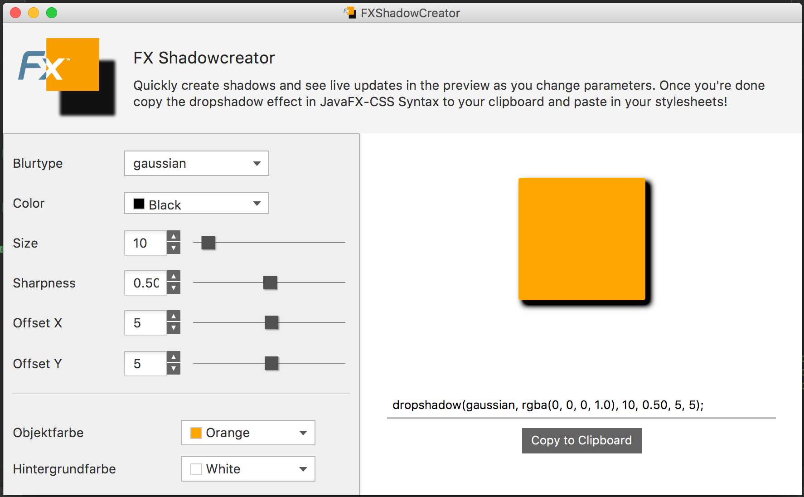

#  JavaFX Shadow Creator
This small tool provides an esay to use GUI to create JavaFX dropshadow effects quickly without having to read the documentation every single time. The different parameters of the dropshadow effect can be tweaked and the effects are updated on a preview in real time. Once the effect is satisfactory the required CSS string can be copied to the clipboard and pasted in a stylesheet of a JavaFX application.

The user interface of the shadow creator:

>:information_source: A prepackaged .jar for immediate use is included in the repo [here](ShadowCreator.jar)
